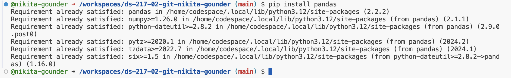

# **Python File from Assignment 1 :**
```
print("Hello, Data Science!")
```

Write a Python script to solve the following:
_If we list all the natural numbers below 10 that are multiples of 3 or 5, we get (3, 5, 6, 9)._ 
_The sum of these multiples is 23. Find the sum of all the multiples of 3 or 5 below 1000._

```
sum=0

for i in range(1000):
    if i % 3 == 0 or i % 5 == 0:
        sum += i
    
print(sum)
```

Adding a link to the official [Python website](https://www.python.org)


